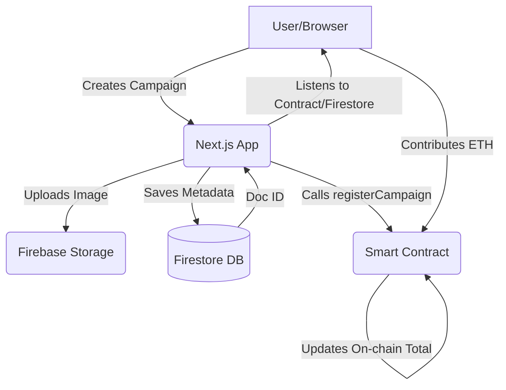

# 🧠 Decentralized Crowdfunding DApp

A **decentralized crowdfunding platform** built using **Next.js (App Router)** on the frontend and **Solidity smart contracts** deployed to an Ethereum-compatible blockchain. This DApp enables users to **create fundraising campaigns**, **view campaign details**, and **contribute ETH** securely using MetaMask. All campaign metadata is stored in **Firebase Firestore**, while financial transactions and totals are stored **on-chain**, ensuring full **transparency, security, and decentralization**.

---

## 🚀 Live Demo

🔗 [Visit the Live App](https://decentralized-crowdfunding-woad.vercel.app)  

---

## 📚 Table of Contents

- [Project Purpose](#project-purpose)
- [Architecture Overview](#architecture-overview)
- [Features](#features)
- [Tech Stack](#tech-stack)
- [Codebase Structure](#codebase-structure)
- [Getting Started](#getting-started)
  - [Prerequisites](#prerequisites)
  - [Installation](#installation)
  - [Environment Variables](#environment-variables)
- [Smart Contract Deployment](#smart-contract-deployment)
- [Available Scripts](#available-scripts)
- [Code Quality & Standards](#code-quality--standards)
- [Deployment Guide](#deployment-guide)
- [Troubleshooting](#troubleshooting)
- [FAQ](#faq)
- [Future Enhancements](#future-enhancements)
- [Contributing](#contributing)
- [Author](#author)

---

## 🎯 Project Purpose

The Decentralized Crowdfunding DApp was built to solve the transparency and trust issues prevalent in traditional crowdfunding platforms (e.g., Kickstarter, GoFundMe). 

**What it does:** It allows users to create, manage, and contribute to fundraising campaigns.
**Why it exists:** To eliminate middlemen, reduce fees, and provide immutable proof of funds raised.
**Target Users:** Campaign creators seeking transparent funding, and crypto-native users looking to support projects securely.
**Core Business Goal:** Bridge the gap between Web2 usability and Web3 trustless execution.

---

## 🏗 Architecture Overview

The application utilizes a **Hybrid Architecture**:

1. **Frontend (Next.js):** Handles the UI, routing, and user interactions.
2. **Off-chain DB (Firebase Firestore & Storage):** Stores heavy campaign metadata (images, rich text descriptions, categories) to save gas costs on Ethereum.
3. **On-chain State (Ethereum Smart Contract):** Tracks ETH balances, individual contributions, and manages fund withdrawals securely.

### Flow Diagram



---

## 🌟 Features

- 🔐 **Decentralized & Trustless** — Financial state is governed by the `CrowdfundingFactory.sol` smart contract.
- 💰 **Crypto Funding (ETH)** — Contribute securely using MetaMask with `ethers.js`.
- 🧾 **Real-time Sync** — Off-chain metadata (Firestore) and on-chain metrics sync seamlessly.
- 🔍 **Campaign Discovery** — Search, filter, and view detailed stats (goals, unique contributors).
- 🛡️ **Admin Approval System** — Admin panel to approve/reject campaigns before they go live on-chain.
- 📤 **Social Sharing** — Built-in modal for sharing campaigns across social platforms.
- 🖼️ **Modern UI/UX** — Responsive, accessible design using Tailwind CSS, Radix UI (via Shadcn), and GSAP animations.
- 🪙 **UPI Payment Fallback** — Optional UPI QR code generation for non-crypto contributors.

---

## 🧰 Tech Stack

| Category | Technology | Reason for choosing |
| :--- | :--- | :--- |
| **Framework** | Next.js 15 (App Router) | Server-side rendering, API routes, and optimized routing. |
| **Runtime** | Node.js | Fast, scalable JavaScript runtime. |
| **Styling** | Tailwind CSS v3 | Utility-first styling for rapid UI development and custom design tokens. |
| **Animations** | GSAP | High-performance, complex web animations. |
| **Smart Contracts**| Solidity (v0.8.28), Hardhat | Industry standard for Ethereum contract development and testing. |
| **Web3 Client** | Ethers.js (v6) | Connecting frontend UI to Ethereum blockchain and MetaMask. |
| **Database** | Firebase Firestore | NoSQL document database for fast, off-chain metadata storage. |
| **Storage** | Firebase Storage | Blob storage for user-uploaded campaign images. |
| **UI Components**| Radix UI / Lucide React | Accessible headless components and modern iconography. |

---

## 📂 Codebase Structure

```text
.
├── contracts/                  # Hardhat Smart Contracts (Solidity)
│   └── CrowdfundingFactory.sol # Core factory contract managing campaigns
├── src/
│   ├── app/                    # Next.js App Router
│   │   ├── admin/              # Admin dashboard for approving campaigns
│   │   ├── api/                # Next.js Serverless API routes
│   │   ├── campaigns/          # Public campaign listings and details
│   │   ├── dashboard/          # Creator's private dashboard
│   │   ├── layout.jsx          # Root layout and context providers
│   │   └── page.jsx            # Landing page
│   ├── components/             # Reusable React components
│   │   ├── ui/                 # Base UI components (buttons, cards, loaders)
│   │   └── modals/             # Share, UPI, and Confirmation modals
│   ├── context/                # React Context (e.g., Web3 connection state)
│   ├── firebase/               # Firebase initialization and config (`config.js`)
│   ├── utils/                  # Helper functions and services
│   │   ├── campaignService.js  # Firestore CRUD operations
│   │   ├── contractService.js  # Ethers.js contract interactions
│   │   ├── contributeToWallet.js # Contribution logic
│   │   └── constants.js        # ABI and Contract Addresses
├── test/                       # Hardhat smart contract test suites
├── public/                     # Static assets (images, fonts, icons)
├── hardhat.config.js           # Hardhat configuration (networks, compiler)
├── tailwind.config.mjs         # Custom Tailwind tokens and theme config
└── package.json                # Project dependencies and scripts
```

---

## 🚀 Getting Started

### Prerequisites

- **Node.js** (v18 or higher)
- **MetaMask** browser extension installed.
- **Firebase Account** with Firestore and Storage enabled.

### Installation

1. **Clone the repository:**
   ```bash
   git clone https://github.com/sdhage1502/decentralized-crowdfunding.git
   cd decentralized-crowdfunding
   ```

2. **Install dependencies:**
   ```bash
   npm install
   ```

### Environment Variables

Create a `.env.local` file in the root directory. This file is required for Firebase integration and Next.js setup.

```env
# Firebase Configuration (Get these from your Firebase Console)
NEXT_PUBLIC_FIREBASE_API_KEY="your-api-key"
NEXT_PUBLIC_FIREBASE_AUTH_DOMAIN="your-auth-domain"
NEXT_PUBLIC_FIREBASE_PROJECT_ID="your-project-id"
NEXT_PUBLIC_FIREBASE_STORAGE_BUCKET="your-storage-bucket"
NEXT_PUBLIC_FIREBASE_MESSAGING_SENDER_ID="your-messaging-sender-id"
NEXT_PUBLIC_FIREBASE_APP_ID="your-app-id"

# Smart Contract (Set after deploying via Hardhat)
NEXT_PUBLIC_CONTRACT_ADDRESS="your-deployed-contract-address"
```

> **Warning:** Never commit your `.env.local` file to version control.

---

## ⛓ Smart Contract Deployment

To run a local blockchain and deploy the contract for development:

1. **Start Hardhat local node:**
   ```bash
   npx hardhat node
   ```

2. **Deploy the contract:**
   Open a new terminal window:
   ```bash
   npx hardhat run scripts/deploy.js --network localhost
   ```

3. **Update Frontend Constants:**
   Copy the deployed contract address from the terminal output and update your `.env.local` file or `src/utils/constants.js`.

---

## 📜 Available Scripts

| Command | Description |
| :--- | :--- |
| `npm run dev` | Starts the Next.js development server on `localhost:3000`. |
| `npm run build` | Builds the Next.js application for production. |
| `npm run start` | Starts the production server (after running build). |
| `npm run lint` | Runs ESLint to check for code quality issues. |
| `npx hardhat test` | Runs the smart contract unit tests using Chai/Mocha. |

---

## 📏 Code Quality & Standards

- **Component Architecture:** Functional React components using hooks. Keep UI components stateless where possible.
- **Services:** All external API, Firebase, and Blockchain calls are abstracted into `src/utils/*Service.js` files.
- **Styling:** Tailwind CSS using custom CSS variables (e.g., `bg`, `surface`, `primary`) defined in `tailwind.config.mjs` to support Dark Mode natively.
- **Formatting:** ESLint is configured for Next.js strict mode. 

---

## 🌐 Deployment Guide

This project is optimized for deployment on **Vercel**.

1. Push your code to a GitHub repository.
2. Log in to [Vercel](https://vercel.com) and create a new project.
3. Import your GitHub repository.
4. Add all environment variables from your `.env.local` to the Vercel Environment Variables section.
5. Click **Deploy**. Vercel will automatically run `npm run build`.

**Smart Contract Production Deployment:**
To deploy to a live testnet (e.g., Sepolia) or Mainnet, update `hardhat.config.js` with your RPC URL and Private Key, then run:
```bash
npx hardhat run scripts/deploy.js --network sepolia
```

---

## 🛠 Troubleshooting

- **MetaMask doesn't connect:** Ensure you are on the correct network (Localhost 8545 for dev) and that the Hardhat node is running. Reset your MetaMask account if you get nonce errors.
- **Firebase Permission Denied:** Check your Firestore and Storage security rules (`firestore.rules` and `storage.rules`). Ensure read/write access is properly configured.
- **Contract Calls Failing:** Verify that `NEXT_PUBLIC_CONTRACT_ADDRESS` matches exactly with the address generated by your recent Hardhat deployment.

---

## ❓ FAQ

**Q: Why use Firebase if it's a Decentralized App?**
A: Storing large strings (like descriptions) and images on Ethereum is prohibitively expensive. We use a hybrid model: heavy data off-chain (Firebase), financial truth on-chain.

**Q: Can a creator withdraw funds before the goal is met?**
A: Currently, yes. The smart contract allows the creator to withdraw any collected funds at any time.

**Q: How is admin approval handled?**
A: Campaigns are saved to Firestore with `isActive = false`. The admin dashboard allows an authorized user to set it to `true` and call `registerCampaign` on the smart contract.

---

## 🔮 Future Improvements

**High Priority**
- Migrate off-chain metadata from Firebase to **IPFS / Arweave** for complete decentralization.
- Add refund mechanisms in the smart contract if funding goals are not met by a deadline.

**Medium Priority**
- Implement Subgraphs (The Graph) for faster on-chain data querying.
- Add comprehensive user profiles and contribution history.

**Nice-to-have**
- Support for ERC-20 tokens (e.g., USDT, USDC) instead of just raw ETH.
- Email or push notifications for campaign milestones.

---

## 👨‍💻 Author

**Shreyash Dhage** – Full Stack Developer  
📍 Pune, India  
📧 [sdhage1502@gmail.com](mailto:sdhage1502@gmail.com)  
🔗 [GitHub](https://github.com/sdhage1502) | [LinkedIn](https://www.linkedin.com/in/shreyashdhage/)

---

## ⭐ Contributing

Contributions, issues, and feature requests are welcome!  
Feel free to check the [issues page](https://github.com/sdhage1502/decentralized-crowdfunding/issues). If you like this project, please consider giving it a ⭐ on GitHub.
